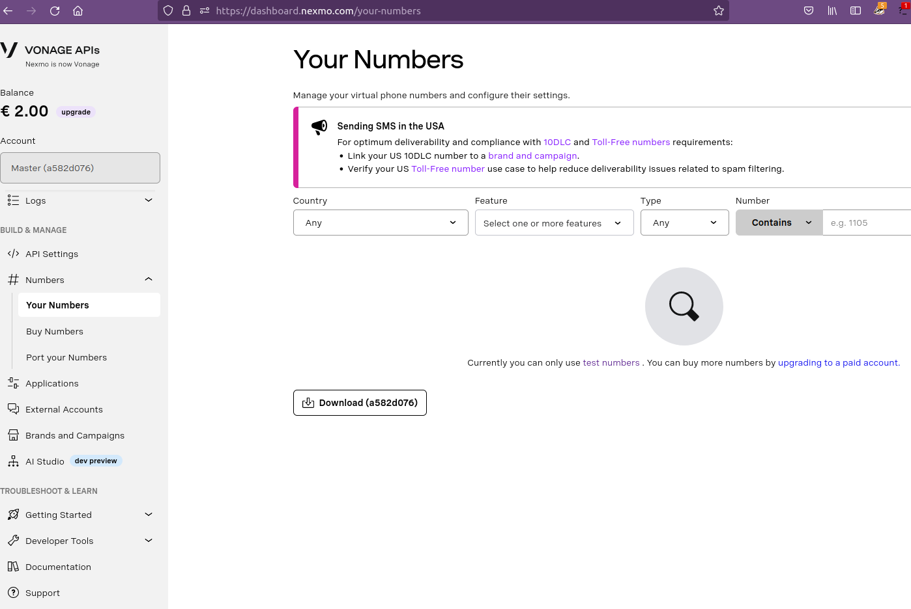
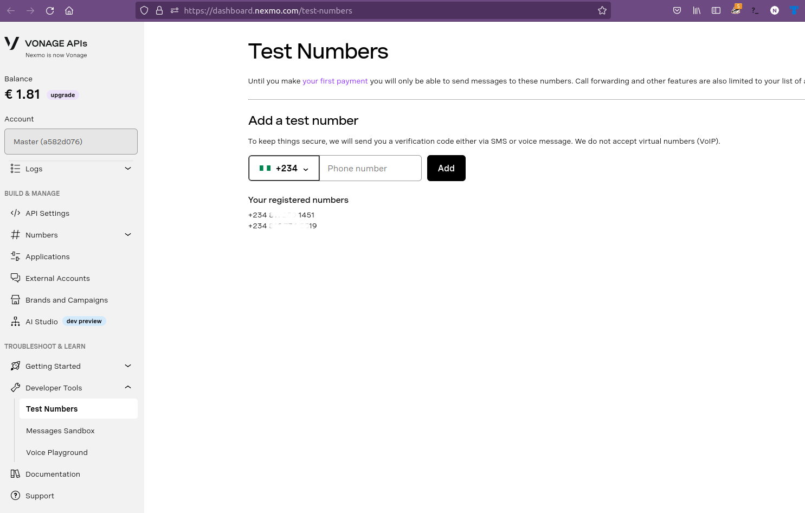

## Send SMS Messages with Node.js using the Vonage API

[Github Repo]()

Vonage is an American telecommunications company headquartered in New Jersey.

The company is a publicly held business cloud based communications provider.

Vonage offers SMS, MMS, Voice, and Video Streaming services via their API gateway.

Vonage's SMS API enables you to send and receive text messages to and from users worldwide, with these [features](https://developer.vonage.com/messaging/sms/overview):

- Programmatically send and receive high volumes of SMS globally.
- Send SMS with low latency and high delivery rates.
- Receive SMS using local numbers.
- Scale your applications with familiar web technologies.
- Pay only for what you use, nothing more.
- Auto-redact feature to protect privacy.

The Aim of this project is to create a simple Nodejs RESE API that uses Vonage SMS API

## Step 1: Initialize Your Project

Start by initializing a Nodejs project in your project folder, and install the Vonage Server SDK for Node.js in your working directory:
Also install the ExpressJs framework and DotEnv for enviromental virables

```bash
$ npm init -y
$ npm install @vonage/server-sdk --save
$ npm i dotenv express

```


Your `package.json` will look similar to this:

```json
{
  "name": "vonage-sms",
  "version": "1.0.0",
  "description": "",
  "main": "index.js",
  "scripts": {
    "start": "node index"
  },
  "keywords": [],
  "author": "",
  "license": "ISC",
  "dependencies": {
    "@vonage/server-sdk": "^2.11.1",
    "dotenv": "^16.0.1",
    "express": "^4.18.1"
  },
  "type": "module"
}
```

Add "type": "module" to your package.json file to be able to use import statements.

## Step 2: Create two files

1. lib.js: a library file for the `sendSms` function that initializes a Vonage instance with your API credentials
2. index.js: the main (entry) point for your application.


```js
// lib.js
import Vonage from "@vonage/server-sdk";
import 'dotenv/config'

const vonage = new Vonage({
    apiKey: process.env.VONAGE_API_KEY,
    apiSecret: process.env.VONAGE_API_SECRET,
});

const sender = process.env.VONAGE_VIRTUAL_NUMBER;

export const sendSms = (recipient, message) => {
    return new Promise((resolve, reject) => {
    console.log("Initial");
    vonage.message.sendSms(sender, recipient, message, (err, responseData) => {
            if (err) {
                console.log(err);
                reject(err.message)
            } else {
                if (responseData.messages[0]["status"] === "0") {
                    console.dir(responseData);
                    resolve(responseData);
                } else {
                    console.log(
                        `Message failed with error: ${responseData.messages[0]["error-text"]}`
                    );
                    reject(`${responseData.messages[0]["error-text"]}`);
                }
            }
        }
    )  
  })
};
```

```js
import express from "express";
import 'dotenv/config'
import { sendSms } from "./lib.js";

const PORT = process.env.PORT;
const { json, urlencoded } = express;

const app = express();

app.use(json());
app.use(
    urlencoded({
        extended: true,
    })
);

app.post('/send', (req, res) => {
    const { phone, message } = req.body;
    sendSms(phone, message)
        .then((data) => res.json({ success: true, data }))
        .catch((err) => res.json({ success: false, message: err }));
});

app.listen(PORT, () => {
    console.log(`Server listening at http://localhost:${PORT}`);
});
```


## Step 3: get and Set your Vonage API Credentials

Find your API key and secret in your Vonage [Dashboard](https://dashboard.nexmo.com/) and assign them to enviromental variables in `.env`
 
```js
PORT=3000
VONAGE_VIRTUAL_NUMBER=GIFTI
VONAGE_API_KEY=abc123
VONAGE_API_SECRET=P1Qxyz000000
```

## Step 4: Configure Sender Virtual Number or Register Recipient Test Number


### To get Your Number, click [here](https://dashboard.nexmo.com/your-numbers)
- Go to the `Dashboard`
- Click `Number`, then Click `Your Numbers`



There, you can manage your virtual phone numbers and configure their settings.
*However*, for newly signup users, you can only use test numbers because you can only buy more numbers after upgrading to a paid account.

### To get Test Numbers, click [here](https://dashboard.nexmo.com/test-numbers)



Until you upgrade your account by making your first payment, you will only be able to send messages to these numbers. 

Add one or more phone numbers at your dispossable. Vonage will send you a verification code either via SMS or voice message.


## Step 5: Finally, run your nodejs express application

Open Postman, Insomnia, or any http client and post to your server

[http://localhost:3000/send](http://localhost:3000/send)


#### POST Request:

```json
{
	"phone": "+234 test-phone",
	"message": "Hi Developer, testing for Vonage"
}
```

#### POST Response:

```json
{
	"success": true,
	"data": {
		"messages": [
			{
				"to": "234-test-phone",
				"message-id": "866cf22f-c55f-482b-81ba-faa02c69578e",
				"status": "0",
				"remaining-balance": "1.71020000",
				"message-price": "0.09660000",
				"network": "62130"
			}
		],
		"message-count": "1"
	}
}
```

If you receive the error message 

`Non-Whitelisted Destination. Your Vonage account is still in demo mode. While in demo mode you must add target numbers to your whitelisted destination list.`

Then know that you need to verify if the reipient phone number is registered as a test-phone number as stated in step 4.


